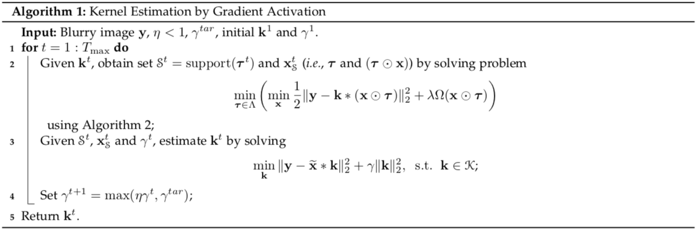
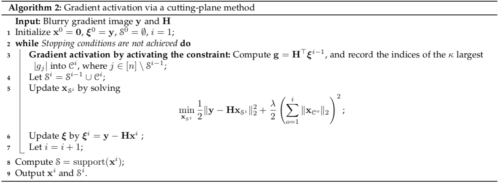
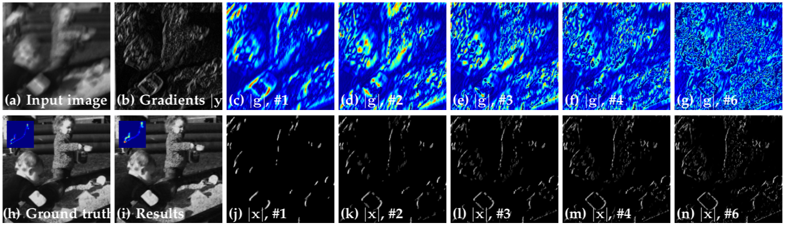

# gradact-deblurring
<small>Blind Image Deblurring via Automatic Gradient Activation    
Dong Gong, Mingkui Tan, Yanning Zhang, Anton van den Hengel, and Qinfeng Shi  
<!-- \[[Paper](https://donggong1.github.io/publications.html)\] -->
[Paper]
<small>

+ This package is an implemenation and **upgrade** for the paper:

<small>Blind Image Deconvolution by Automatic Gradient Activation  
Dong Gong, Mingkui Tan, Yanning Zhang, Anton van den Hengel, Qinfeng Shi  
In IEEE Conference on Computer Vision and Pattern Recognition (CVPR), 2016.  
\[[Paper](http://openaccess.thecvf.com/content_cvpr_2016/papers/Gong_Blind_Image_Deconvolution_CVPR_2016_paper.pdf)\]
<small>

The upgraded version of the paper and theoretical proof will also be released soon. 

## Overview of the algorithm

 

 

## Usage
+ MATLAB is required.
+ Preparing the data.
+ Running the scripts:
  + Running `script_test_levin_data.m` for processing Levin et al.'s data;
  + Running `TODO` for processing any image as configured;
+ Before running the scripts, please configure the `root_path`, `inpath`, `outpath` and hyper-parameters.

## Visulization

+ Visulization of the cutting-plane based gradient activation process:
 

